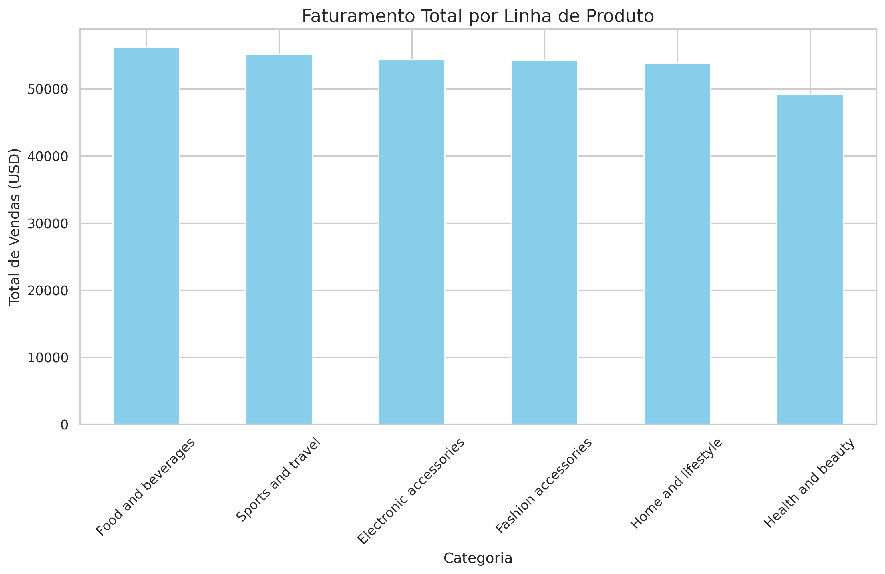

# 📊 Análise de Vendas

Projeto focado em identificar padrões de vendas, oportunidades de crescimento e apoio à tomada de decisão.

Em desenvolvimento 🚀

"C:\Users\Usuario\Downloads\WhatsApp Image 2026-04-24 at 21.02.38 (1).jpeg"

## 🔍 Principais Descobertas
As categorias "Food and beverages" e "Sports and travel" apresentaram o maior volume de vendas totais.

O projeto envolveu o tratamento de dados (ETL), criação de novas métricas como o lucro bruto (Gross_Profit) e visualização com a biblioteca Seaborn.

## 🛠️ Organização do Projeto
Estrutura de pastas padronizada para facilitar a manutenção e escalabilidade do projeto (Pastas: data, notebooks, sql).
