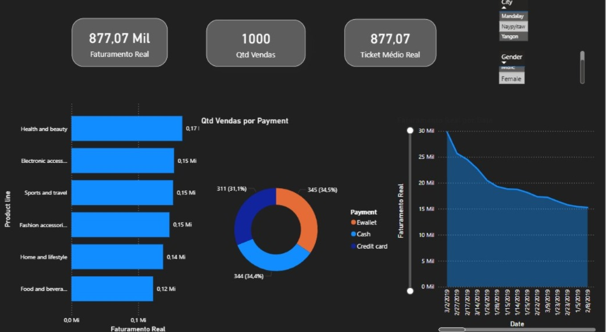

# 📊 Análise de Vendas

Projeto focado em identificar padrões de vendas, oportunidades de crescimento e apoio à tomada de decisão.

Em desenvolvimento 🚀

### 🛠️ Detalhes da Implementação Técnico-Analítica

O objetivo desta etapa foi criar um dashboard executivo que permitisse a leitura rápida dos principais indicadores de desempenho (KPIs) do supermercado.

- **Normalização de Dados via DAX:** Identifiquei que os valores de vendas estavam com erro de escala e utilizei medidas calculadas para reajustar o faturamento e o ticket médio.
- **UI/UX Design:** Implementação de Dark Mode para redução de fadiga visual e uso de botões do tipo "Tile" para filtros, otimizando o espaço da tela.
- **Integração de Visões:** Mix de Pagamento (Gráfico de Rosca) e Tendência Temporal (Gráfico de Linhas) para análise de comportamento de consumo.

## 🔍 Principais Descobertas
As categorias "Food and beverages" e "Sports and travel" apresentaram o maior volume de vendas totais.

O projeto envolveu o tratamento de dados (ETL), criação de novas métricas como o lucro bruto (Gross_Profit) e visualização com a biblioteca Seaborn.

## 🛠️ Organização do Projeto
Estrutura de pastas padronizada para facilitar a manutenção e escalabilidade do projeto (Pastas: data, notebooks, sql).
